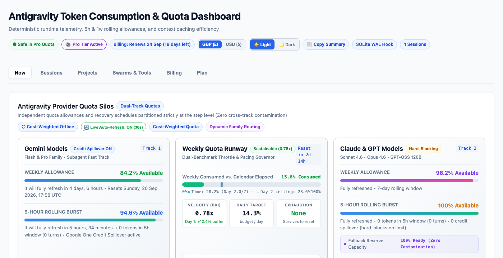
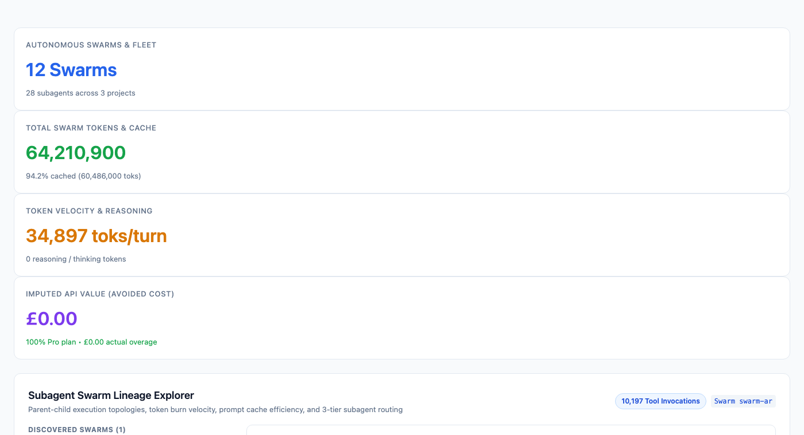
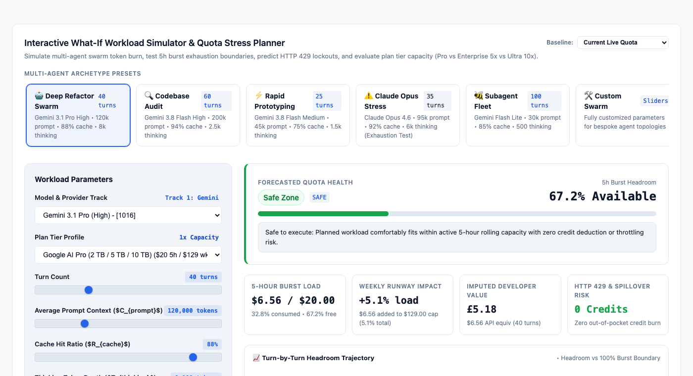
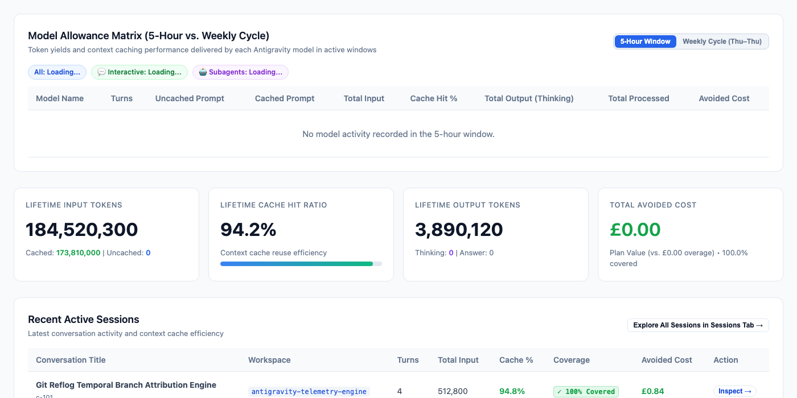
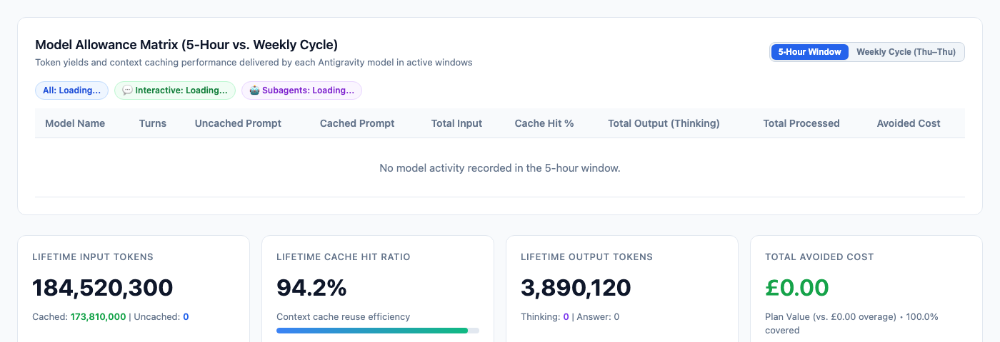
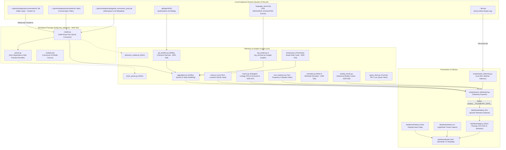

# Antigravity Token Consumption & Quota Dashboard

A deterministic, zero-dependency, offline-first telemetry engine, live watcher daemon, and visual analytics dashboard for tracking **token consumption, context caching efficiency, reasoning tokens, and quota velocity** across Google Antigravity workspaces — with **benchmarks comparing usage against developer API rate cards**.

[](LICENSE)
[](https://www.python.org/)
[-success.svg)](antigravity_telemetry/)
[](docs/milestones/M36_GITHUB_PAGES_LIVE_SHOWCASE.md)
[](https://github.com/Eneasf/antigravity-token-dashboard/actions)
[](https://eneasf.github.io/antigravity-token-dashboard/)
[](antigravity_telemetry/models.json)
[](docs/TELEMETRY_SPEC.md)
[](docs/FINDINGS.md)

**Documentation Hub**: [🌐 **Live Interactive Demo**](https://eneasf.github.io/antigravity-token-dashboard/) &nbsp;|&nbsp; [📘 Telemetry Specification](docs/TELEMETRY_SPEC.md) &nbsp;|&nbsp; [🔬 Architecture Whitepaper](docs/FINDINGS.md) &nbsp;|&nbsp; [🏗️ System Design](docs/SYSTEM_DESIGN.md) &nbsp;|&nbsp; [📦 Python Package](antigravity_telemetry/README.md) &nbsp;|&nbsp; [📋 ADR Log](docs/HANDOVER.md)

> [!NOTE]
> **Independent Personal Project & Employer Disclaimer**:
> This project is a completely personal, independent work created and maintained by me in my personal spare time. It has **no relationship with, connection to, or endorsement from my current employer**. No employer equipment, internal infrastructure, confidential data, or proprietary work products were used in the conception, development, or maintenance of this software.
>
> **Community Tool Disclaimer**: This is an independent, community-developed observability tool and is not affiliated with, endorsed by, or sponsored by Google or Alphabet. Antigravity and Gemini are trademarks of Google LLC. This tool cannot resolve account billing disputes or Google One subscription issues.

> [!IMPORTANT]
> **Why This Exists & What It Solves**:
> - **The Problem**: Google Antigravity runs agentic coding workflows with autonomous multi-model turn sequences, but provides minimal developer visibility into token burn velocity, context cache hit rates, reasoning token overhead, or when workloads will trip the 5-hour rolling burst or weekly subscription rate limits.
> - **What This Tool Does**: It inspects local runtime databases and wire protobuf telemetry offline to show exactly where tokens and quota go: cache hit percentages, reasoning vs. visible output splits, subagent routing tiers, and theoretical rate-card cost comparisons (**Avoided Cost / Plan Value ROI**).
> - **What It Does NOT Do**: This tool is strictly an observational analysis and benchmark suite. It **does NOT control, throttle, proxy, or alter API traffic**, and does not modify any Google billing accounts.

> [!TIP]
> **Architecture, AI Pair Programming & Governance (ADR-050 / Milestone 36)**:
> This project was developed through human architectural direction (problem scoping, wire protocol extraction, safety invariants, and acceptance gates) paired with AI coding agents for implementation under strict engineering governance:
> - **50 Architecture Decision Records (ADRs)** formally documenting data contracts and algorithms ([`docs/HANDOVER.md`](docs/HANDOVER.md)).
> - **Verifiable Acceptance Gates (`VDONE.md`)** requiring executable verification commands and proofs before merging.
> - **Zero-Dependency & Offline Safety**: Pure-Python standard library with read-only SQLite URI access (`mode=ro`).
> - **Curated Snapshot Releases**: Development was conducted privately across 36 iterative milestones (`docs/milestones/`). The public repository receives curated release snapshots.

---

## Visual Showcase (Light Mode Standard)

| Provider Quota Silos & Weekly Runway Governor Deck |
| :---: |
|  |
| *Dual-track quota silos (Gemini Pro/Flash vs. Claude/GPT hard-blocking), weekly velocity runway indicator with daily pacing buffer, and 5-hour rolling burst monitor with live reset countdown.* |

<br>

| Subagent Lineage & Hierarchy Explorer (ADR-037 / Milestone 24) |
| :---: |
|  |
| *Interactive parent-child agent DAG visualization, multi-agent token burn velocity, 3-tier subagent routing economics (1050 Lite, 1322 Fast, 1036 Pro Low), and runtime tool execution analytics.* |

<br>

| Interactive "What-If" Workload Simulator & Stress Planner (ADR-035 / Milestone 21) |
| :---: |
|  |
| *Deterministic sequence simulation modeling multi-agent workloads, live quota safety gauge, plan tier sensitivity comparisons (Pro Baseline, Enterprise 5x, Ultra 10x), and turn trajectory previews.* |

<br>

| Portfolio Projects & Temporal Git Reflog Branch Costing (ADR-022 / ADR-046) |
| :---: |
|  |
| *Hierarchical multi-workspace aggregation, authoritative Git reflog checkout interval attribution (`.git/logs/HEAD`), context caching efficiency, and plan value benchmark.* |

<br>

| Turn-by-Turn Telemetry & Thinking Token Inspector |
| :---: |
|  |
| *Step-level telemetry inspection exposing uncached vs. cached prompts, reasoning/thinking token breakdown, avoided cost benchmark, and API response IDs.* |

---

## Core Capabilities

### 1. Subagent Lineage & Tool Performance Intelligence (Milestone 24 / ADR-037)
- **Interactive Parent-Child DAG Layout**: Reconstructs true multi-agent swarm lineages from `data/antigravity_vault.db` (`invoke_subagent` tool calls), rendering clean, acyclic interactive SVG hierarchy graphs in 100% offline browser execution.
- **3-Tier Subagent Routing Economics**: Automatically partitions agent swarms into standard tiers:
  - **Mechanical Execution Tier** (Model `1050` / Gemini Flash Lite)
  - **Standard Engineering Tier** (Model `1322` / Gemini Fast Agent Assistant)
  - **Complex Architecture Tier** (Model `1036` / Gemini 3.1 Pro Low Reasoning)
- **Runtime Tool Execution Analytics**: Deep metrics across 23 tools and 10,000+ invocations (`src/tool_analytics.py`), quantifying terminal sandbox bypass ratios, tool failure rates, and skill activation distribution.

### 2. Dual-Track Quota Silos & Runway Governor (Milestones 09, 17, 32 / ADR-019, ADR-031, ADR-045)
- **Independent Provider Quota Silos**: Isolates **Track 1 (Google Gemini)** with Google One AI credit bank spillover from **Track 2 (Anthropic Claude & GPT on Vertex)** which enforce hard HTTP 429 blockouts with zero credit spillover.
- **Dynamic Weekly Reset Cycle Bounds**: Dynamically anchors cycle boundaries to the active subscription profile (Sunday 17:58:04 UTC for Ultra 5x, Thursday 18:00 UTC for Pro era), synchronized live with Connect-RPC desktop indicator `reset_time`.
- **Weekly Quota Runway & Burn Velocity**:
  - Smooths early-cycle burn rate to avoid false alarms in the first 48 hours of a billing cycle.
  - Clear pacing indicators showing whether your current burn rate is ahead of or behind your weekly quota budget.
- **5-Hour Rolling Burst Monitor**: Visualizes continuous sliding-window quota headroom, burst turn count, live refresh countdown clock (*"It will fully refresh in 4 hours, 12 minutes"*), and 20-bucket SVG staircase recovery gauge (Safe $\ge 50\%$, Comfortable $\ge 80\%$, Full $100\%$).

### 3. Authoritative Git Reflog & Multi-Workspace Attribution (Milestones 11, 33 / ADR-022, ADR-046, ADR-047)
- **Temporal Reflog Source of Truth**: Resolves Antigravity's static conversation database snapshot limitation (where checkouts collapsed into `main`, inflating `main` to 80%+ turns) by extracting Git reflog (`.git/logs/HEAD`) transitions.
- **Microsecond Turn Attribution**: Correlates nanosecond turn timestamps against dynamic checkout intervals, resurrecting historical feature branches with zero token leakage.
- **Anti-Bloat Modular Architecture**: Reflog parsing and LRU interval caching live in standalone zero-dependency module `src/git_timeline.py` (<320 lines) connected via a minimal ~25-line hook in `src/aggregator.py`.
- **Operational Quality Gates & Live Daemon Protocol (ADR-047)**: Mandates live export (`scripts/export_dashboard.py`) to refresh `dashboard/data.js` against authentic databases, LaunchAgent daemon kickstart (`scripts/setup_service.py restart`), and status assertion across quality gates.
- **Multi-Project Workspace Attribution**: Extracts root workspace paths directly from `trajectory_metadata_blob` and `agyhub_summaries_proto.pb`.

### 4. Predictive Workload Simulation & Pre-Flight CLI Gating (Milestones 21, 29 / ADR-035, ADR-042)
- **Interactive "What-If" Workload Simulator**: Pure-Python simulation engine (`src/simulator.py`) and reactive client-side UI modeling multi-agent turn sequences (tokens, costs, 5h burst exhaustion, weekly runway, and 429 risk) before dispatching heavy swarms.
- **5 Multi-Agent Archetype Presets**: *Deep Refactor Swarm*, *Codebase Audit*, *Rapid Prototyping*, *Claude Opus Stress Test*, and *Subagent Fleet*.
- **Pre-Flight Budget Checker CLI**: `scripts/agy_quota.py --can-i-run <archetype|custom>` with deterministic exit codes (`0` SAFE/PROCEED vs `1` BLOCKED/429 RISK) for CI pipeline gating.
- **Byte-Deterministic Standup Digest**: Generates Markdown standup summaries (`scripts/export_dashboard.py --markdown`) and provides a 1-click UI clipboard button (`📋 Copy Summary`).

### 5. Standalone Zero-Dependency Telemetry Package (`antigravity_telemetry` - Milestone 27 / ADR-040)
- **Independent Reusable Package**: Core pure-Python wire protobuf decoder and safe read-only SQLite connector extracted into an independent, zero-dependency Python package (`antigravity_telemetry/`) installable via standard `pyproject.toml`.
- **Clean Public API**: `read_all_turns()`, `discover_all_conversations()`, and `decode_wire_protobuf()`.
- **Canonical 19-Model Census**: Standardized catalog (`models.json`) covering all internal Antigravity model IDs (e.g. `1318` Gemini 3.8 Flash High, `1016` Gemini 3.1 Pro High, `1026` Claude Opus 4.6 Thinking, `342` GPT-OSS 120B) decoupled from pricing or quota logic.
- **Fast Standalone CLI**: `python -m antigravity_telemetry dump --json`, `conversations --json`, and `models --json`.

### 6. Permanent Telemetry Vault & Historical Trends (Milestones 08, 26, 28 / ADR-018, ADR-039, ADR-041)
- **Lossless SQLite Vault**: Permanent store (`data/antigravity_vault.db`) archiving full decoded turn text, raw protobuf blobs (hybrid, zero `.pkl`), workspace attribution, and subagent DAG lineage across upstream IDE database purges.
- **8–12 Week SVG Trendline Chart**: Pure-Python weekly trends engine (`src/weekly_trends.py`) aggregating historical cycles with instant UI toggling between Processed Tokens, Cost & Overage, and Peak Burn Velocity.
- **Append-Only 429 Exhaustion Ledger**: Persistent ledger (`data/exhaustion_ledger.json`) preserving verified Google One credit overages (3,640 credits burned across 03–10 Sep 2026) resilient against upstream log file truncations.
- **Multi-Tier Plan Upgrades & Provenance**: Active tracking of Google AI Ultra 5x (£79.99/mo / $99.99/mo) and Pro tiers via temporal intervals in `config/pricing.json` and `subscription_history_archive`.

### 7. Light Mode Standard & Visual Showcase Overhaul (Milestone 34 / ADR-048 / v2.0.0)
- **Canonical Light Mode Elevation**: Reconfigures CSS design tokens (`:root`), browser pre-render bootstrapping, and headless screenshot captures to default to crisp, high-contrast Light Mode (`#f8fafc` canvas, `#ffffff` cards, `#e2e8f0` structural borders), while maintaining 100% responsive Dark Mode persistence via interactive client-side switching.
- **6-View Showcase Generation**: Automated headless Retina capture pipeline (`scripts/capture_showcase_screenshots.py`) delivering 6 high-resolution Light Mode assets including the Subagent Swarm Lineage DAG and What-If Workload Simulator.

---

## Architecture Overview



---

## Documentation & Architecture Hub

Detailed specifications, runtime analysis papers, and architectural blueprints:

| Document | Focus & Key Insights | Target Audience |
|---|---|---|
| [📘 **Telemetry Specification** (`docs/TELEMETRY_SPEC.md`)](docs/TELEMETRY_SPEC.md) | **Protobuf Wire Specification & Field Mappings**: Wire protobuf field IDs (`9.2` uncached prompt, `9.5` cached prompt, `9.9` thoughts/reasoning, `9.10` candidate tokens), wire types, SQLite database schema (`steps`), and conversation turn taxonomy. | Telemetry parser developers, agent authors, protocol researchers |
| [🔬 **Architecture & Telemetry Whitepaper** (`docs/FINDINGS.md`)](docs/FINDINGS.md) | **In-Depth Runtime Analysis**: Deep technical report on Google Antigravity's internal architecture, Connect-RPC desktop quota protocol, Google One AI credit billing mechanics, 94% context cache efficiency, KV cache eviction on model flips, and 3-tier subagent routing. | System architects, LLM engineers, observability researchers |
| [🏗️ **System Design & Architecture** (`docs/SYSTEM_DESIGN.md`)](docs/SYSTEM_DESIGN.md) | **Pipeline & Storage Blueprint**: Multi-tier architecture covering read-only SQLite WAL tailing (`?mode=ro`), lossless event sourcing, permanent vault sync, debounced watcher daemons, and offline HTML data hook injection contracts. | Core contributors, pipeline engineers, systems programmers |
| [📦 **Standalone Package Guide** (`antigravity_telemetry/README.md`)](antigravity_telemetry/README.md) | **Zero-Dependency Python Library**: Complete guide to using the extracted `antigravity_telemetry` package via clean public API (`read_all_turns()`, `discover_all_conversations()`) or fast CLI (`python -m antigravity_telemetry dump --json`). | Python developers, automation scripts, external agent workflows |
| [📋 **Master Handover & ADR Log** (`docs/HANDOVER.md`)](docs/HANDOVER.md) | **Architecture Decision Records**: Complete index of 49 settled ADRs documenting data contracts, rate cards, calendar reset algorithms, and quota reconciliation formulas. | Maintainers, code auditors, historical reviewers |

---

## Metric Formulas & Definitions

> [!TIP]
> All financial metrics below are **theoretical rate-card benchmarks** calculated from published pricing to help evaluate subscription savings and context cache ROI. They do not represent active API invoices or an API spending control gateway.

| Metric | Upstream Telemetry Source | Mathematical Definition |
|---|---|---|
| **Total Input Tokens** | Field `9.2` + Field `9.5` | `prompt_token_count` (uncached) + `cached_content_token_count` |
| **Cached Input Tokens** | Field `9.5` | Tokens served from Gemini Context Cache |
| **Uncached Input Tokens** | Field `9.2` | Fresh prompt tokens evaluated by the model |
| **Total Output Tokens** | Field `9.3` | `candidates_token_count` (`Field 9.9 + Field 9.10`) |
| **Thinking / Reasoning Tokens** | Field `9.9` | `thoughts_token_count` (internal model chain of thought) |
| **Visible Answer Tokens** | Field `9.10` | Output tokens visible in conversation / code generation |
| **Cache Hit Ratio (%)** | Derived | `(Cached Tokens / Total Input Tokens) * 100` |
| **Subscription Coverage (%)** | Derived from confirmed 429 intervals | `(Turns in Quota / Total Turns) * 100` (£0.00 marginal spend) |
| **Actual Overage (Paid)** | Derived from `data/exhaustion_ledger.json` | True out-of-pocket charges from credit bank during confirmed 429 exhaustion |
| **Avoided Cost (Plan Value)** | Derived from `config/pricing.json` | Theoretical developer API savings delivered by the subscription (for comparison; not billed API costs) |
| **Comparative API Cost** | Derived from `config/pricing.json` | Benchmark calculation: `(Uncached * Price_in) + (Cached * Price_cached) + (Output * Price_out)`. Used strictly for plan ROI comparison, not an active billing charge or spending control. |

---

## Quickstart

### 1. Requirements
- Python 3.9+ (pre-installed on macOS/Linux)
- A modern web browser (Chrome, Safari, Firefox, Edge)

### 2. Export Telemetry to Dashboard
Generate the deterministic dashboard snapshot across all local Antigravity conversations:
```bash
# Standard live export (refreshes dashboard/data.js)
python3 scripts/export_dashboard.py

# Export byte-deterministic Markdown standup digest to stdout
python3 scripts/export_dashboard.py --markdown

# Export in isolated offline CI mode (bypasses live Connect-RPC network calls)
python3 scripts/export_dashboard.py --no-live-quota
```

To open the dashboard immediately (defaults to crisp Light Mode with instant Dark Mode toggle):
```bash
open dashboard/index.html
```

### 3. Run the Live Watcher Daemon
To monitor active conversations and automatically refresh metrics in near real-time with debounced export triggers during coding sessions:
```bash
# Foreground watcher (auto-debounces rapid bursts with a 2s settle window)
python3 scripts/watch_telemetry.py

# Foreground watcher + embedded local HTTP server (http://127.0.0.1:8088/)
python3 scripts/watch_telemetry.py --serve --port 8088

# Single-cycle headless extraction for CI or scripting
python3 scripts/watch_telemetry.py --once
```

### 4. Background Service Packaging (macOS LaunchAgent)
To run the watcher permanently in the background as a user daemon with auto-restart and log rotation:
```bash
# Validate template syntax and paths
python3 scripts/setup_service.py validate

# Install LaunchAgent into ~/Library/LaunchAgents/
python3 scripts/setup_service.py install

# Load service into launchctl
launchctl load -w ~/Library/LaunchAgents/com.antigravity.telemetry.watcher.plist

# Check running status
python3 scripts/setup_service.py status

# Restart running daemon
python3 scripts/setup_service.py restart

# Inspect live daemon logs
tail -f ~/Library/Logs/Antigravity/telemetry_watcher.stdout.log

# Unload and remove daemon
python3 scripts/setup_service.py uninstall
```

### 5. Inspect Live Desktop Quota & Pre-Flight Capacity
Query the Antigravity desktop indicator via Connect-RPC, inspect instantaneous quota status (<5ms), or gate multi-agent workloads:
```bash
# Print fast executive status for terminal prompts / tmux / starship (<5ms)
python3 scripts/agy_status.py
python3 scripts/agy_status.py --short
python3 scripts/agy_status.py --json

# Print live desktop quota status via Connect-RPC (text or JSON)
python3 scripts/agy_quota.py
python3 scripts/agy_quota.py --json

# Pre-flight workload capacity planner CLI (deterministic exit code: 0 proceed, 1 blocked)
python3 scripts/agy_quota.py --can-i-run deep_refactor_swarm
python3 scripts/agy_quota.py --can-i-run custom --turns 25 --model 1318 --json

# Inspect or calibrate active subscription plan and renewal days (ADR-038)
python3 scripts/configure_plan.py

# Run empirical rate card regression and cost-weighted quota convergence analysis
python3 scripts/quota_regression.py

# Use the standalone package CLI
python3 -m antigravity_telemetry dump --json
python3 -m antigravity_telemetry models --json
```

### 6. Run Automated Tests
Verify protobuf parsing, metric math, debounce coalescing, vault storage, temporal pricing, workload simulations, swarm lineage, tool analytics, git reflog intervals, and documentation integrity (185 tests, ~6s):
```bash
python3 -m unittest discover -s tests
```

---

## Repository Structure

```
.
├── LICENSE                 # MIT License
├── CONTRIBUTING.md         # Contribution guidelines and invariants
├── SECURITY.md             # Vulnerability disclosure policy
├── CODE_OF_CONDUCT.md      # Contributor Covenant
├── AGENTS.md               # Canonical working agreement and git protocols
├── README.md               # This project documentation
├── VDONE.md                # Verifiable quality gates register
├── pyproject.toml          # Standard packaging metadata for antigravity-telemetry (ADR-040)
├── antigravity_telemetry/  # Standalone zero-dependency telemetry engine (ADR-040)
│   ├── __init__.py         # Public API: read_all_turns(), discover_all_conversations()
│   ├── __main__.py         # Fast CLI entrypoint (dump --json, models, conversations)
│   ├── parser.py           # Pure-Python protobuf wire-format decoder
│   ├── reader.py           # Safe read-only SQLite extractor with retry lock resilience
│   ├── models.json         # Canonical 19-model census without pricing coupling
│   └── README.md           # Standalone package documentation
├── config/
│   ├── pricing.json        # Benchmark pricing matrix (15 models), plans, and promotions
│   ├── pricing.sample.json # Anonymized template for pricing and plan calibration
│   └── com.antigravity.telemetry.watcher.plist.template # LaunchAgent daemon template
├── data/
│   └── exhaustion_ledger.sample.json # Anonymized template for 429 exhaustion ledger
├── docs/
│   ├── SYSTEM_DESIGN.md    # Architecture, SQLite WAL ingestion, and protobuf parsing
│   ├── TELEMETRY_SPEC.md   # Field schemas, message wire types, and turn taxonomy
│   ├── FINDINGS.md         # Authoritative systems architecture whitepaper on runtime telemetry, quotas & billing
│   ├── HANDOVER.md         # Master decision index (ADR log), milestones, and open work
│   └── milestones/         # Historical milestone slices (M01 to M36)
├── src/
│   ├── proto_parser.py     # Pure Python protobuf wire-format decoder
│   ├── telemetry_reader.py # Read-only SQLite extractor with retry lock resilience
│   ├── log_reader.py       # Log extractor for 429 RESOURCE_EXHAUSTED events & ledger
│   ├── log_archiver.py     # Background log archiver ingesting raw events into SQLite vault
│   ├── quota_client.py     # Connect-RPC client querying live Language Server quota
│   ├── aggregator.py       # Metrics aggregator, rolling quota, and dual-tier credit engine
│   ├── vault.py            # SQLite telemetry vault & archival store for steps/lineage
│   ├── temporal.py         # Timestamp-aware temporal rate cards & plan profile resolver
│   ├── simulator.py        # Deterministic what-if workload simulator & stress planner
│   ├── swarm.py            # Subagent swarm lineage extraction, multi-agent economics & DAG layout
│   ├── tool_analytics.py   # Tool execution frequency, sandbox bypass ratios & skill performance
│   ├── weekly_trends.py    # Historical weekly cycle aggregation, overage correlation & trendline analytics
│   └── git_timeline.py     # Authoritative Git reflog checkout interval extractor & branch resolver (ADR-046)
├── scripts/
│   ├── export_dashboard.py # Deterministic HTML exporter & executive status hook generator
│   ├── watch_telemetry.py  # Near real-time debounced watcher daemon
│   ├── setup_service.py    # macOS LaunchAgent lifecycle manager
│   ├── agy_status.py       # Fast CLI status hook inspector (<5ms) for terminal prompts
│   ├── agy_quota.py        # CLI interface exposing live Antigravity desktop quota
│   ├── quota_regression.py # Empirical rate card regression & convergence test harness
│   ├── ingest_statement.py # Credit statement extraction and ledger reconciliation
│   ├── configure_plan.py   # CLI tool to inspect and calibrate plan configuration (ADR-038)
│   ├── capture_showcase_screenshots.py # Headless showcase screenshot generator in Light Mode
│   ├── setup_github_guardrails.py # Automated repository branch protection & templates
│   ├── build_demo_showcase.py # Generates deterministic, zero-PII synthetic demo telemetry for GitHub Pages
│   ├── build_ci_fixtures.py # Generates reproducible, anonymized offline Antigravity fixtures
│   └── publish_to_public.py # Safeguarded release publisher for public showcase repository
├── dashboard/
│   ├── index.html          # Semantic responsive analytics UI (Light/Dark themes)
│   ├── demo.html           # Local convenience launcher for interactive demo showcase
│   ├── styles.css          # Core CSS tokens (Light default), theme definitions, layout grids
│   ├── app.js              # Client routing, SVG DAG renderer, and simulator engine
│   └── meta.js             # Fast telemetry hash-gating script (<250 bytes)
└── tests/
    ├── test_proto_parser.py     # Tests for varint decoding and field extraction
    ├── test_log_reader.py       # Tests for 429 exhaustion regex extraction & ledger
    ├── test_log_archiver.py     # Tests for log archival daemon and SQLite vault storage
    ├── test_aggregator.py       # Tests for metrics calculations and cost modeling
    ├── test_export_dashboard.py # Tests for deterministic data hook injection
    ├── test_watch_telemetry.py  # Tests for debounce coalescing and daemon lifecycle
    ├── test_quota_client.py     # Tests for Connect-RPC client and offline fallback
    ├── test_vault.py            # Tests for telemetry vault schema, blobs, and recovery
    ├── test_temporal.py         # Tests for temporal intervals, rates, and promotions
    ├── test_simulator.py        # Tests for turn sequence simulation and plan comparison
    ├── test_swarm.py            # Tests for swarm lineage extraction, economics, and tier routing
    ├── test_tool_analytics.py   # Tests for tool analytics aggregation, bypass detection & error rates
    ├── test_quota_attribution.py # Tests for 5h session attribution, cache coaching, and plan config
    ├── test_weekly_trends.py    # Tests for weekly cycles grouping, overage reconciliation & trendline math
    ├── test_ingest_statement.py # Tests for statement parsing and reconciliation
    ├── test_agy_status.py       # Tests for status hook file generation and agy_status CLI
    ├── test_antigravity_telemetry_pkg.py # Tests for standalone package API, CLI, and zero-dep hygiene
    ├── test_model_roster_integrity.py # Tests for canonical 19-model roster integrity & drift prevention (Gate V136)
    ├── test_preflight_budget.py # Tests for pre-flight workload capacity planner CLI (--can-i-run) and deterministic exit codes
    ├── test_markdown_export.py  # Tests for byte-deterministic standup digest generation (--markdown)
    ├── test_overage_weighting.py # Tests for rate-card spend proportional overage credit attribution (A5)
    ├── test_ci_fixtures.py      # Tests for offline fixture discovery, token census, and byte-determinism
    ├── test_git_timeline.py     # Tests for Git reflog checkout interval extraction & branch resolution
    ├── test_sanitization.py     # Tests for PII, enterprise terms, and telemetry sanitization (ADR-049)
    ├── test_demo_showcase.py    # Tests for synthetic showcase generator, schema compliance, and zero PII
    └── test_docs_integrity.py   # Automated documentation integrity and drift prevention
```
