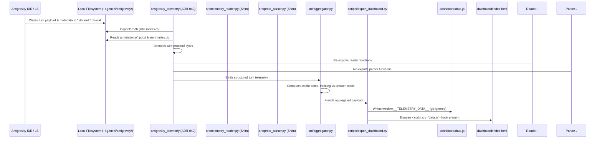
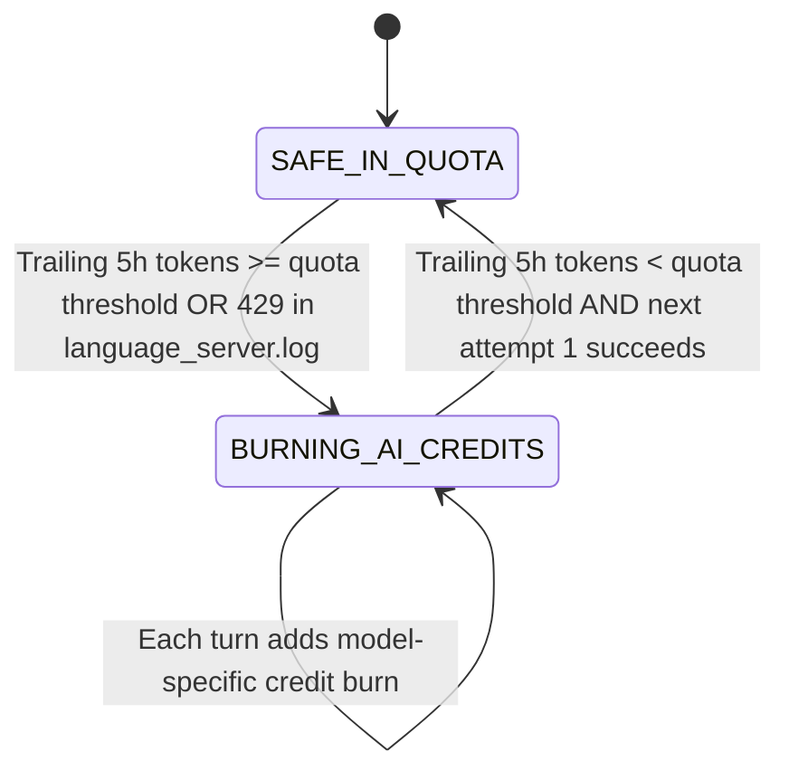

# System Design: Antigravity Token Consumption & Quota Dashboard

## 1. Architectural Principles

1. **Non-Intrusive Read-Only Ingestion**:
   - The system ingests telemetry directly from Antigravity's local SQLite database files located at `~/.gemini/antigravity/conversations/*.db`.
   - Databases are actively modified by the Antigravity desktop IDE and Language Server (`language_server`).
   - To guarantee zero file lock conflicts, write starvation, or database corruption, all connections use SQLite's URI read-only syntax:
     ```python
     sqlite3.connect(f'file:{db_path}?mode=ro', uri=True)
     ```
   - Queries operate cleanly even when SQLite Write-Ahead Logging (`*.db-wal` / `*.db-shm`) is active.

2. **Zero-Dependency Protobuf Wire Decoding**:
   - Upstream telemetry is stored inside `steps.metadata` as binary serialized Google Protocol Buffers.
   - Rather than requiring `protoc` compiler installations or external protobuf libraries, the engine implements a pure Python standard-library wire-format parser.
   - The parser decodes varints (wire type 0), 64-bit fixed (wire type 1), length-delimited byte chunks / submessages / strings (wire type 2), and 32-bit fixed (wire type 5) in a single linear pass.

3. **Event Sourcing & CQRS Pattern**:
   - The Antigravity conversation databases are the **immutable event logs** (system of record).
   - Each turn with `step_type = 15` (`PLANNER_RESPONSE`) constitutes an immutable token consumption event.
   - The dashboard data and aggregations are strictly **disposable read projections** that can be completely regenerated at any time.

4. **Decoupled Offline Delivery & Clean Presentation Isolation (ADR-024)**:
   - To eliminate context bloat and git repository churn while preserving 100% offline capability, telemetry data is decoupled from the HTML presentation:
     ```html
     <!-- In dashboard/index.html <head> -->
     <script src="data.js"></script>
     ```
   - `scripts/export_dashboard.py` writes `dashboard/data.js` (`window.__TELEMETRY_DATA__ = { ... };`), which is ignored in `.gitignore`.
   - **Design Constraints Maintained**:
     1. **Zero CORS restrictions**: Browser `<script src="data.js">` tags execute synchronously from `file:///` URLs without triggering cross-origin security blocks.
     2. **Lossless Telemetry Preservation**: 100% of turn telemetry, models, and session data is retained in `data.js` and permanently in `data/antigravity_vault.db`.
     3. **Context & Git Hygiene**: `dashboard/index.html` stays permanently lean (~1,778 lines, 74 KB), eliminating 260,000+ lines of data diffs.
     4. **Backward-Compatible Hook**: The `<script id="injected-dashboard-data" type="application/json">` hook remains intact for fallback and optional standalone embedding (`--embed` flag).

5. **Standalone Importable Telemetry Engine (`antigravity_telemetry` - ADR-040)**:
   - The core pure-Python wire protobuf decoder and read-only SQLite connector are extracted into an independent, zero-dependency Python package (`antigravity_telemetry/`).
   - The package operates strictly on the Python standard library with zero external dependencies (`sqlite3`, `pathlib`, `json`, `datetime`, `re`, `typing`).
   - Provides canonical 19-model census (`models.json`) without coupling to pricing, quotas, or currencies.
   - Provides standalone CLI (`python -m antigravity_telemetry dump --json`) for terminal workflows and subagent integration.
   - Preserves 100% backward compatibility via re-export shims in `src/proto_parser.py` and `src/telemetry_reader.py`.

---

## 2. Telemetry Ingestion Pipeline



---

## 3. Real-Time Watcher Architecture

To support near real-time tracking while developing in Antigravity:
1. `scripts/watch_telemetry.py` tracks the modification timestamps (`st_mtime_ns`) and sizes of:
   - `~/.gemini/antigravity/conversations/*.db`
   - `~/.gemini/antigravity/conversations/*.db-wal`
2. When a change in file size or modification time is detected, the watcher parses the latest step additions in the active conversation DB.
3. The watcher incrementally updates the projected dataset and refreshes `dashboard/index.html` or broadcasts to an optional local HTTP server.

---

## 4. Model Pricing & Cost Allocation

Gemini token pricing is configured in `config/pricing.json`:
- **Prompt Tokens (Uncached)**: Rate per million tokens ($ / 1M tokens)
- **Prompt Tokens (Cached Content)**: Discounted cache rate per million tokens ($ / 1M tokens)
- **Candidate Tokens (Output)**: Rate per million tokens ($ / 1M tokens) for generated responses (including reasoning tokens).

Formula for each turn $i$:
$$\text{Cost}_i = \left(\frac{\text{Uncached}_i}{10^6} \times P_{\text{uncached}}\right) + \left(\frac{\text{Cached}_i}{10^6} \times P_{\text{cached}}\right) + \left(\frac{\text{Output}_i}{10^6} \times P_{\text{output}}\right)$$

$$\text{Cache Hit \%} = \begin{cases} \frac{\text{Cached}_i}{\text{Uncached}_i + \text{Cached}_i} \times 100 & \text{if } \text{Uncached}_i + \text{Cached}_i > 0 \\ 0.0 & \text{otherwise} \end{cases}$$

---

## 5. Hybrid Overage Detection & AI Credit Burn Calibration (ADR-010)

### 5.1 Dual-Track Billing Model: Imputed Value vs. AI Credit Burn
1. **Imputed Subscription Value ($)**:
   - For all turns executed within the user's Pro quota allowance, marginal out-of-pocket cost is \$0.00.
   - The dashboard reports the dollar equivalent of tokens delivered as **Imputed Value** using baseline rates.
2. **AI Credit Burn (Credits & $)**:
   - When quota capacity is exhausted and `"useAiCredits": true` is enabled, upstream requests bill against purchased AI credits.
   - Valuation: Google sells AI credits at \$25 per 2,500 credits ($1\text{ credit} = \$0.01$).
   - The dashboard reports both integer **AI Credits Burned** (reconciling directly with the official Google One activity portal) and **Out-of-Pocket Cash Burn** ($\text{Credits} \times \$0.01$).

### 5.2 The 3-State Subscription Machine
Subscription status transitions across three states:
- `SAFE_IN_QUOTA`: Trailing 5-hour volume is below model capacity; all turns covered by subscription.
- `BURNING_AI_CREDITS`: Quota breached; subsequent turns accrue credit burn.
- `RECOVERED_COOLDOWN`: Older turns aged out; capacity restored; future turns return to \$0 marginal cost.



### 5.3 Signal-Anchored Overage Detection (ADR-014)
- **Signal-Anchored Invariant**: The database stores raw turn tokens without billing signals. High token volume alone does NOT imply out-of-pocket billing. Out-of-pocket AI credit deductions trigger **strictly** when `language_server.log` records a confirmed `RESOURCE_EXHAUSTED` (HTTP 429) server rejection.
- **Recovery & Cooldown**: When a 429 event occurs, the overage window extends across a 5-hour cooldown period, after which quota status returns to `SAFE_IN_QUOTA`.
- **Calendar Cycles & Horizons**:
  - **Weekly Allowance Cycle**: Resets every **Thursday at 19:00 BST (18:00 UTC)**. Active consumption is bucketed strictly from the preceding Thursday reset point.
  - **Monthly Billing Horizon**: Renews on the **24th of each month** at 19:00 BST (e.g. 24 September 2026), tracking the user's £23.99 / 2,500 credits Google One subscription budget.

### 5.4 Model-Specific Credit Rates
Credit burn rates reflect model compute tiers rather than flat turn counts:
- **Gemini 3.8 / 3.7 Flash** (`1318`, `1298`): **2.5 credits / turn** (~$0.025)
- **Gemini 3.1 Pro** (`1016`, `1036`): **15.0 – 20.0 credits / turn** (~$0.15 – $0.20)
- **Claude Sonnet 4.6 (Thinking)** (`1035`): **25.0 – 35.0 credits / turn** (~$0.25 – $0.35)
- **Claude Opus 4.6 (Thinking)** (`1026`): **50.0 – 75.0 credits / turn** (~$0.50 – $0.75)

---

## 6. Decoupled Dual-Tier Financial Subsystem (ADR-015)

The engine cleanly separates the user's software plan into two distinct accounting tiers:

1. **Tier 1: Google One AI Premium (Antigravity Pro Subscription)**:
   - **Cost Structure**: Fixed recurring **£18.99 / mo** (**$19.99 / mo**), renewing on the **24th of each month**.
   - **Capacity**: Unlimited in-quota usage across models with £0 marginal cost.
   - **Value Metric**: Tracks **Imputed API Equivalent Value** and **Subscription ROI Multiplier**:
     $$\text{Subscription ROI} = \frac{\text{Monthly Cycle Imputed Value}}{\text{Monthly Subscription Price}}$$
     *(e.g. £30.76 API equivalent delivered / £18.99 monthly fee = 1.6x ROI).*

2. **Tier 2: Prepaid Overage Credit Bank (AI Credit Activity)**:
   - **Cost Structure**: One-time or top-up add-on pack of **2,500 credits** for **£23.99** (**$25.00**).
   - **Unit Price**: **£0.009596 / credit** (~0.96p) or **$0.0100 / credit** (1.0¢).
   - **Debit Rule**: Debited strictly when 5-hour rolling quotas burst or external API models demand direct credit billing.
   - **State Isolation**: Tracks credit pool balance (1,321 credits remaining = £12.68 / $13.21) and cumulative deduction (1,179 credits burned = £11.31 / $11.79).

---

## 7. Persistent Exhaustion Ledger (ADR-016)

To protect against Antigravity's behavior of truncating `~/Library/Logs/Antigravity/language_server.log` upon IDE application restart:
- An append-only persistent ledger is maintained at [`data/exhaustion_ledger.json`](../data/exhaustion_ledger.json).
- `src/log_reader.py` first ingests all confirmed historical exhaustion incidents from the ledger, guaranteeing that verified Google One statement deductions (e.g., -748 and -431 credits on 05 Sep 2026) are never lost when logs rotate.
- Live, unrecorded 429 entries detected in the active log file are dynamically clustered and merged without double-counting existing ledger intervals.

---

## 8. Sliding-Window Quota Age-Out Timeline & Dynamic Refresh Engine (ADR-025)

### 8.1 Continuous Sliding-Window Recovery Math
Antigravity's rolling 5-hour quota recovers continuously rather than resetting as an all-or-nothing event. Each turn executed at timestamp $T$ ages out exactly at $T + 5\text{ hours}$, releasing its processed token burden and restoring available headroom.

The recovery trajectory engine in `src/aggregator.py` (`compute_window_recovery_trajectory`):
1. Samples the upcoming 5-hour horizon $[T_{\text{now}}, T_{\text{now}} + 5\text{h}]$ across 20 uniform 15-minute bucket intervals.
2. Evaluates the cumulative token drop-offs aging out before each time boundary $t$:
   $$\text{Headroom Available \%}(t) = \min\left(100.0, \frac{\text{Capacity} - (\text{Used} - \text{Cumulative Recovered}(t))}{\text{Capacity}} \times 100\right)$$
3. Computes exact minute-level arrival times for critical usability milestones:
   - **Safe Zone ($\ge 50\%$ available)**: Headroom needed to safely run moderate agent workloads.
   - **Comfortable ($\ge 80\%$ available)**: Low-risk operating zone for large prompt contexts.
   - **Full Recovery ($100\%$ available)**: All turns in the active 5-hour window fully aged out.

### 8.2 Responsive SVG Staircase Visualization & Live Ticker
- **Visual Gauge**: Rendered as a responsive vector SVG (`#svg-recovery-chart`) with horizontal reference lines at 100%, 80%, 50%, and 25%. A step-line path with semi-transparent area fill reflects discrete turn roll-offs. Interactive scrubbers allow inspecting available tokens, headroom percentage, and time remaining at each step.
- **Client-Side Live Clock Tick**: A 30-second interval ticker (`updateTimelineTick`) decrements minute countdowns and shifts available headroom upward in real-time without full page reloads.
- **Dynamic Decoupled Auto-Refresh**: Seamlessly detects new Antigravity turns via cache-busted `<script src="data.js?t=...">` injection on tab focus (`visibilitychange`) and every 30 seconds when the auto-refresh toggle is enabled.

### 8.3 3-Card Single-Row Quota Triad & Marker Clustering (ADR-025b)
- **Single-Row Quota Layout**: Integrates the 5-Hour Recovery Timeline card directly into the `Antigravity Provider Quota Silos` CSS grid alongside Gemini Models and Claude & GPT Models, creating a balanced 3-column row (`repeat(auto-fit, minmax(320px, 1fr))`) that eliminates vertical scrolling and presents quota status, fallback capacity, and temporal recovery in one glance.
- **Marker Time-Clustering**: To prevent overlapping circle collisions when developers run rapid prompt bursts, turns occurring within $\pm 4$ minutes are clustered into single milestone nodes showing aggregate token yield, turn count, and resulting headroom percentage upon hover.

---

## 9. Subagent Swarm Lineage Explorer & Tool Analytics Engine (ADR-037)

### 9.1 Multi-Agent Swarm Extraction (`src/swarm.py`)
- Discovers multi-agent hierarchical swarms across Antigravity SQLite stores and Telemetry Vault (`data/antigravity_vault.db`).
- Reconciles parent-child links prioritizing authoritative `invoke_subagent` tool calls (`caller_id` -> `conversationId`), bidirectional agent messages (`[Message] sender=...`), and `conversations_archive.parent_convo_id`.
- Aggregates multi-agent swarm economics:
  - Total tokens, duration, USD/GBP costs, turn counts partitioned into Root Orchestrator vs. Subagent Fleet.
  - Subagent 3-tier routing breakdown:
    - Tier 1 Mechanical (`Model: "flash_lite"` / Model `1050`)
    - Tier 2 Engineering (`Model: "flash"` / Model `1322`)
    - Tier 3 Architecture (`Model: "pro"` / Model `1036`)
    - Tier 4 Other / Inherit
- Builds node and edge graph structures for interactive SVG DAG rendering with 100% offline `file:///` compatibility.

### 9.2 Tool Execution & Skill Performance Analytics (`src/tool_analytics.py`)
- Audits `tool_calls_archive` and `skills_archive` in the Vault.
- Analyzes 10,000+ tool calls across 23 runtime tools:
  - Invocation frequency distributions.
  - Sandbox bypass ratio (`"BypassSandbox": true` detection, ~47.8% on `run_command`).
  - Error rate detection (non-zero exit codes, tracebacks, fatal lines).
- Categorizes tools into Terminal, Filesystem, Subagents, Web, Interactive, Media, and MCP.
- Aggregates skill activation counts and activation types.
